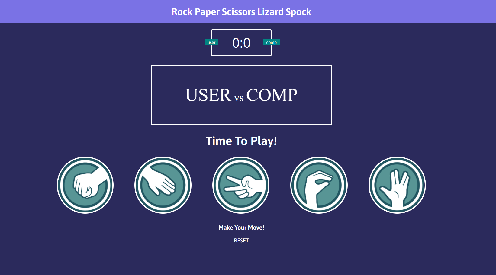

# Title: Rock Paper Scissors Lizard Spock
# Website [LINK](https://antoniobaciu.github.io/rock-paper-scissors-lizard-spock/)

# Short introduction:
__Rock Paper Scissors Lizard Spock__ is an interpretation under the form of a simple browser game 
wich has additional rules inspired form an episode of the famous series "The Big Bang Theory".

__The Game Rules:__

* Scissors cut Paper
* Paper covers Rock
* Rock crushes Lizard
* Lizard poisons Spock
* Spock smashes Scissors
* Scissors decapitate Lizard
* Lizard eats Paper
* Paper disproves Spock
* Spock vaporizes Rock
* Rock crushes Scissors

__Features:__
- [x] Score counter
- [x] The score is changing color depending on winner (user/computer)
- [x] Each choice button has an explanatory image
- [x] Each choice button is highlighted depending on the result of the game (win/lost/tie)
- [x] Reset button
